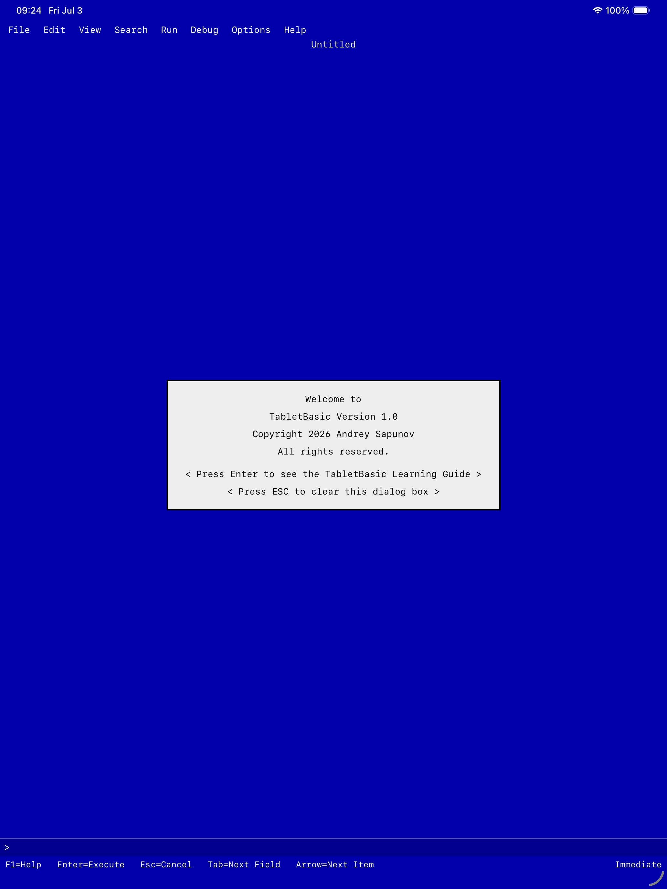

# TabletBasic

TabletBasic is a retro BASIC learning environment for iPhone, iPad, and Mac,
built with SwiftUI and a native Swift interpreter.

It is inspired by Microsoft QuickBASIC: the blue-screen IDE, the short path from
typing code to seeing it run, and the feeling that programming can be learned by
experimenting one small line at a time. QuickBASIC was an excellent teaching
tool, and TabletBasic tries to bring that spirit to modern Apple devices without
being an emulator or a Microsoft product.



## What It Includes

- A keyboard-friendly retro IDE with DOS-style menus.
- A built-in BASIC interpreter written in Swift.
- Immediate mode for trying small expressions and statements quickly.
- A learning guide with 16 step-by-step chapters covering the full language.
- A sample program library with 80 built-in programs.
- Open, save, and save-as for `.bas` files via the system file picker.
- Interactive `INPUT` prompts while a program runs.
- Text output plus simple graphics output inspired by classic `SCREEN 13`.
- Unit and UI test targets for the app and interpreter.

## BASIC Support

TabletBasic currently focuses on the parts of BASIC that are most useful for
learning:

- Variables with classic suffixes: `%`, `&`, `!`, `#`, `$`.
- Numeric and string expressions.
- `PRINT`, `INPUT`, `LET`, assignment, `REM`.
- `IF...THEN...ELSE` and block `IF...END IF`.
- `SELECT CASE...CASE...END SELECT`.
- `FOR...NEXT`, `WHILE...WEND`, `DO...LOOP`, `EXIT`.
- Line-number control flow: `GOTO`, `GOSUB`, `RETURN`, `ON...GOTO`,
  `ON...GOSUB`.
- Arrays with `DIM`.
- Inline data with `DATA`, `READ`, and `RESTORE`.
- Random numbers with `RANDOMIZE` and `RND`.
- Simple graphics: `SCREEN`, `CLS`, `COLOR`, `PSET`, `PRESET`, `LINE`, `CIRCLE`.
- String functions including `LEFT$`, `RIGHT$`, `MID$`, `UCASE$`, `LEN`, `STR$`, `VAL`.
- A small set of built-in math and formatting functions.

The goal is educational compatibility, not full QuickBASIC compatibility. Some
programs will need adjustment, and many advanced DOS-era features are outside
the current scope.

## Project Structure

```text
.
|-- QuickBasic/             SwiftUI app sources
|-- QBEngine/               Swift Package containing the BASIC engine
|-- TabletBasicTests/       App unit tests
|-- TabletBasicUITests/     UI tests and sample-program smoke tests
|-- fastlane/               App Store metadata, screenshots, and release lanes
|-- scripts/                Build and UI-test helper scripts
|-- project.yml             XcodeGen project definition
|-- TabletBasic.xcodeproj/  Generated Xcode project
`-- simulator-launch.png    README screenshot
```

`project.yml` is the project definition. Use `TabletBasic.xcodeproj` for normal
Xcode work, and regenerate it with XcodeGen when the project structure changes.

## Requirements

- macOS with a recent full Xcode installation.
- iOS 17 or newer target device/simulator.
- Swift 6-capable toolchain.
- XcodeGen, only if you need to regenerate the Xcode project.

## Getting Started

Open the app project:

```sh
open TabletBasic.xcodeproj
```

Select the `TabletBasic` scheme, choose an iPhone, iPad, or Mac Catalyst
destination, and run.

If you change `project.yml`, regenerate the project:

```sh
xcodegen generate
```

## Running Engine Tests

The interpreter is a standalone Swift package:

```sh
cd QBEngine
swift test
```

You can also run the tiny CLI smoke test:

```sh
cd QBEngine
swift run qbengine-cli
```

For app and UI tests, use the `TabletBasic` scheme in Xcode.

## CI / Local Validation

From the repo root:

```sh
cd QBEngine && swift test
./scripts/build.sh
./scripts/run-uitests.sh
```

`scripts/build.sh` builds the app for an available iOS Simulator (iPad by default).
`scripts/run-uitests.sh` runs a UI-test smoke subset; set `DEVICE_KIND=iphone` to
prefer an iPhone simulator.

## Design Notes

TabletBasic deliberately keeps the interface simple and tactile. The IDE is
meant to feel familiar to anyone who learned programming in a classic BASIC
environment, while still behaving like a native SwiftUI app on iPhone, iPad,
and Mac.

The engine is separated from the UI so the interpreter can be tested, reused,
and extended independently. The app layer handles editing, menus, lessons,
sample programs, and rendering text/graphics output.

## Roadmap Ideas

- Better editing tools (syntax helpers, undo, multi-cursor).
- More QuickBASIC-compatible statements and functions (e.g. bottom-tested
  `LOOP UNTIL` / `LOOP WHILE`).
- Richer graphics commands and palette behavior.
- Additional sample programs and advanced language features.
- Better diagnostics with source locations and fix suggestions.

## License

Copyright 2026 Andrey Sapunov

Licensed under the Apache License, Version 2.0. See [LICENSE](LICENSE) for the
full license text.

## Trademark Notice

TabletBasic is an independent project and is not affiliated with, endorsed by,
or sponsored by Microsoft or Apple.

Microsoft QuickBASIC is referenced only to describe the historical programming
environment that inspired TabletBasic. Microsoft and QuickBASIC are trademarks
or product names of Microsoft Corporation. iPad, Mac, and Xcode are trademarks
of Apple Inc.
